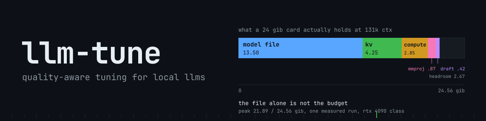

<div align="center">
  
</div>

An agent skill that tunes local LLM settings: quant, context window, KV cache
type, offload, speculative decoding (MTP), sampling, reasoning budget, and
harness settings. Every recommendation names the measurement behind it, and the
skill ships a bench so you can check each number on your own hardware. Any
agent that loads skills or reads rules files can run it.

**Status: v0.2 (2026-10-08).** Scenario-tested and published. The bench scripts
were fixed from a live run and have not been re-run since the fixes; commands
marked "(untested here)" in `skill/bench/` have not been executed in this repo.

## Why

Fit tools answer "does it load". The failures documented here started after the
model loaded:

- a quant loaded fine at 131k context, peaked 24,142 MiB at 152k and OOM'd
  mid-inference
- a model advertising 131k context returned HTTP 400 on a 120k prompt
- a thinking model spent its entire output budget on reasoning and returned
  nothing reviewable

Tuning a local model is a chain of budget decisions (VRAM, host RAM, context,
KV cache, draft head) followed by a quality check (recall at depth, tool-call
reliability, verifier-backed output). Fit is the first gate, and the two can
disagree.

## What the skill does

A 9-step decision procedure. Each step names the rule, the evidence, the trap,
and how to verify.

| Step | Decides | Why it matters |
|---|---|---|
| 1. Fit | VRAM, runtime, and host RAM | Load-time fit is not runtime fit: a model that loads can OOM mid-inference as buffers grow with depth. |
| 2. Context vs quant | The actual lever | Every 32k of context is worth about a quant tier, and declared context is not usable context (HTTP 400 at depth). |
| 3. KV cache type | Whether KV quantisation is your lever | Architecture-dependent: on the measured dense 27B only 16 of 64 layers carry growing KV; a hybrid MoE ran 6 attention plus 23 Mamba layers at ~1.50 GiB. |
| 4. Offload and MoE | Where the model lives | Decode speed is architecture-bound, not quant-bound: MoE entries hit 246-324 t/s vs ~52-119 t/s for the dense 27B, same card. |
| 5. Prefill and ubatch | Chunking strategy | `-ub 1024` gained +31-34% on MoE and nothing on the dense 27B; hardware-class dependent. |
| 6. Speculative / MTP | Draft head depth | Flat +0.42 GiB cost; optimal depth is workload-dependent (d3 best overall, d5 best prose, d3 best code on the measured engine). |
| 7. Sampling and reasoning | Per-model config | Read this model's own card; vendor specs do not transfer between models. `--reasoning-budget -1` produces 20k-token thinking loops with no output. |
| 8. Harness and client | Agent-level settings | Tool-call parsing tolerance took 5/16 failures to 0/16 without touching the model. |
| 9. Non-NVIDIA | Apple Silicon, Intel Arc, AMD, vLLM | Fit arithmetic is universal; memory accounting, flag names, and traps are not. |

Verification is built in: hold quality constant, check recall at depth, three
repeats minimum, alternating arms for A/B, one model on the GPU at a time, and
grade `finish=length` separately from fail.

## Install

The skill is `skill/SKILL.md` plus its references and bench. Any agent that
loads skills or reads a rules file can use it.

### Claude Code

```sh
git clone https://github.com/T-Crypt/llm-tune.git
mkdir -p ~/.claude/skills
cp -r llm-tune/skill ~/.claude/skills/llm-tune
```

Or project-scoped: `mkdir -p .claude/skills && cp -r llm-tune/skill .claude/skills/llm-tune`.
Restart Claude Code; the skill triggers on tuning and sizing questions, OOMs,
truncation, recall loss at depth, or skipped tool calls.

### OpenCode

OpenCode reads SKILL.md-format skills: copy `skill/` into the skills directory
your config points at, or reference the repo path directly. Harness-specific
tuning is in `skill/references/harnesses.md`.

### Pi / OMP

Copy `skill/SKILL.md` into the Pi/OMP skills directory. Pi and OMP need
different tuning priorities than Claude Code (tool-call reliability over raw
speed); see `skill/references/harnesses.md`.

### Other agents

1. Read `skill/SKILL.md`; it is self-contained (intake, decision procedure,
   verification, traps, limitations).
2. Copy `skill/references/` into your agent's reference path, or load the
   files matching your hardware and engine.
3. Run `skill/bench/` before quoting any figure.

Loads by format on: Claude Code, Codex, Cursor, Windsurf, GitHub Copilot,
Cline, Kiro, Qoder, Gemini CLI, Hermes Agent, Devin CLI. Skill-system agents
get the structured procedure; rules-file agents get the same content as a
rules file.

To remove it, delete the `llm-tune` folder from your agent's skill directory
(on Claude Code: `~/.claude/skills/llm-tune`).

## The bench

Every measured number is from one machine class (24 GB RTX 4090-class card,
31 GB RAM). On any other box, run the bench before quoting a figure as yours.
`skill/bench/quick_bench.md` is the walkthrough; the scripts are stdlib-only
and work against any OpenAI-compatible server:

- `needle.py`: plants a fact at a given depth and scores recall per depth
  step, printing prompt size, seconds, recall, and HTTP status.
- `quality_probe.py`: five verifier-graded tasks run R times, printing pass /
  fail / BUDGET counts. BUDGET means the run hit the answer cap with nothing
  to show; a settings failure, not a model failure.
- `mlx_quant_search.py`: estimates which `mlx-community` quants fit an Apple
  Silicon box, using the wired limit rather than total RAM.

It measures, in order: memory accounting (what the engine actually reserves,
not what arithmetic predicts), peak VRAM and peak host RAM per run, prefill
and decode at depth, recall at depth (three planted facts at 10/50/90%), and
a quality probe with repeats. Run-to-run noise of ±1-2 bugs on a 12-bug test
is normal; the spread is the data point.

## Compare and contribute: the local-ai-registry

[local-ai-registry](https://github.com/sybil-solutions/local-ai-registry)
([local.sybilsolutions.ai](https://local.sybilsolutions.ai/)) keeps
community-tested tunes as recipes per card, each carrying a proof block from
the run that validated it: it loads, chats, reasons, calls tools, holds its
context window, and decodes at 15 tok/s or more. This repo's own testing used
the registry's RTX 4090 baselines, published by 0xSero, as reference points
while tuning the author's card.

When your llm-tune session ends with numbers you trust, compare them against
the closest card entry, then feed both directions: a PR to the registry
publishes your recipe with its proof, and a Measurement Report here (see
`CONTRIBUTING.md`) grows these tables. That keeps the numbers relevant to the
community.

## Scope

Read this before trusting a number.

**Measured here** (one 24 GB card, 31 GB RAM, llama.cpp b11115): fit
arithmetic (model + KV + compute + context + overhead), recall-at-depth
failures, prefill and decode speed at depth with repeats, MTP tensor cost and
draft acceptance, harness tool-call parsing behaviour, KV cache architecture
dependence.

**Sourced, not measured** (docs, community reports, official specs; verify on
your own box):

| Unmeasured here | How to fill the gap |
|---|---|
| Hardware diversity: every tier in `hardware-tiers.md` | Fit and crash data from hardware we do not have; the single most valuable contribution |
| Apple Silicon / MLX: cited sources, zero Apple runs | One load test plus a recall check fills the biggest gap |
| Intel Arc / AMD: SYCL, HIP/ROCm, Vulkan all external | Engine-specific traps and fit data |
| Multi-user serving | Batching, cache contention, concurrent models |
| Bench commands: marked "(untested here)" | The measurement patterns are proven; the specific commands are generic llama.cpp |
| Ollama, LM Studio, vLLM numbers | Method and traps transfer; the numbers do not |

**Rules that are method, not measurement:** the intake order and "pick the
metric before tuning"; "three repeats minimum" (the source lab used 3 and 5
runs; no measurement set 3 as a threshold); the fit gate (22,900 MiB) as a
working convention from the source lab, not a measured optimum; partial CPU
offload is measured in direction only (more offload, less speed), the
magnitude claim was the source's expectation.

Where a finding disagreed with the extracted data, it was corrected in place
and the correction is dated in `skill/references/CORRECTIONS.md`. Corrections
win over findings.

## Layout

Grouped by purpose.

### The skill

| Path | Contents |
|---|---|
| `skill/SKILL.md` | The skill: intake, decision procedure, verification, traps, what it does not know |
| `skill/bench/` | The bench: three stdlib scripts plus the command walkthrough in `quick_bench.md` |
| `skill/bench/README.md` | What the bench measures, the rules for readable numbers, the live-test fixes |

### Reference library

| Path | Contents |
|---|---|
| `skill/references/evidence.md` | Index from each decision step to the tables behind it |
| `skill/references/findings.md` | The generalisable lessons (32), each with its sources |
| `skill/references/CORRECTIONS.md` | Where findings disagreed with the data; corrections win |
| `skill/references/tables/` | One table per measurement set, extracted from the DATA-tagged sources |
| `skill/references/hardware-tiers.md` | Every hardware class from 8 GB Intel Arc to 512 GB Mac Studio and DGX (sourced, not measured here) |
| `skill/references/engine-backends.md` | Per-backend fit arithmetic, commands, and traps (CUDA, SYCL, Vulkan, HIP/ROCm, MLX/Metal, Ollama, vLLM) |
| `skill/references/engine-research-sm89.md` | Engine coverage on RTX 4090 (sm_89): what runs, what is Blackwell-only, open issues |
| `skill/references/mlx-mac-tuning.md` | MLX and unified memory, all Mac tiers, wired limit, 75% rule (documented from cited sources) |
| `skill/references/apple-mlx.md` | Apple Silicon / MLX quick reference, documented from cited sources |
| `skill/references/intel-amd-unified.md` | Intel Arc SYCL/Vulkan, AMD Strix/Gorgon Halo HIP/ROCm, BIOS allocation |
| `skill/references/llama-fit-broadening.md` | llama-fit-params across all llama.cpp backends |
| `skill/references/harnesses.md` | Harness-specific tuning: Pi, OMP, Claude-local, OpenCode, Claude Code |
| `skill/references/debloat.md` | Harness debloat, MCP compression, per-tier tool limits |
| `skill/references/safety.md` | Validate-with-operator protocol, model and file deletion safety |
| `skill/references/user-journeys.md` | Five entry-state workflows, from "I have no models" to "pushing the frontier" |
| `skill/references/model-management.md` | HF CLI download, model inventory template, deletion safety |
| `skill/references/vllm-local.md` | vLLM tuning for 2-3 endpoint local serving, multi-model |
| `skill/references/local-orchestration.md` | The LOCAL.md pattern: a chunked command frontier for a local model |

### Data and evidence

| Path | Contents |
|---|---|
| `data/INVENTORY.md` | Catalogue of the source evidence: what was measured, how, headline numbers, usefulness tags |
| `CITED.md` | 50 external sources, every URL verified live on 2026-10-08, with what was extracted and where it is used |

### Contribution and history

| Path | Contents |
|---|---|
| `CONTRIBUTING.md` | Submission template, quality standards, ranked data needs |
| `.github/ISSUE_TEMPLATE/measurement-report.md` | The issue template for quick data submissions |
| `tests/` | Frozen scenario runs: prompts, answers, grading |
| `docs/dev/` | Build plans and review notes |
| `CHANGELOG.md` | What changed and when |
| `assets/` | Banner source (SVG) and render (PNG) |

## Contributing

The evidence base is thin on hardware diversity: one card class, one RAM
class, one OS pair. Priorities, ranked:

1. Fit and crash data from hardware this repo does not have; the single most
   valuable contribution.
2. Recall at depth from other hardware.
3. Quality probes with repeats: three runs minimum, alternating arms.
4. Engine-specific traps: Intel Arc SYCL, AMD HIP/ROCm, MLX, vLLM.
5. Measured Apple Silicon data.
6. Multi-user serving data.

Submit through the Measurement Report issue template or a PR tagged
`data-submission`. `CONTRIBUTING.md` has the template and the quality
standards. Fabricated data is rejected; "not measured on my hardware" is
better than an estimate.

## License

MIT. See `LICENSE`.